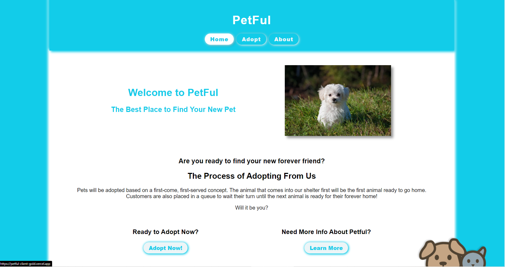

<p align="center">
  <a href="https://petful-client.rohit19060.vercel.app/" title="PetFul">
    
  </a>
</p>
<h1 align="center">🌟 PetFul 🌟</h1>
<p align="center">React application for pet adoption and demonstrating queue data structure in js.</p>

<p align="center">
<a href="https://github.com/Rohit19060/petful-client/blob/master/LICENSE" title="License">

</a>
<a href="https://github.com/Rohit19060/petful-client/fork" title="Forks">

</a>
<a href="https://github.com/Rohit19060/petful-client/stargazers" title="Stars">

</a>
<a href="https://github.com/Rohit19060/petful-client/issues" title="Issues">

</a>
<a href="https://github.com/Rohit19060/petful-client/pulls" title="Pull Requests">

</a>
<a href="https://github.com/Rohit19060/petful-client" title="Repo Size">

</a>
<a href="https://discord.gg/2wpHNSjwm2" title="Join King Tech's Community">

</a>
</p>

<p align="center" title="PetFul"></p>

<h2 align="center">🌐 Links 🌐</h2>
<p align="center">
    <a href="https://github.com/Rohit19060/petful-client" title="PetFul Repo">📂 Repo</a>
    ·
    <a href="https://petful-client.rohit19060.vercel.app/" title="Visit">✨ Live View</a>
    ·
    <a href="https://calm-badlands-17592.herokuapp.com" title="Petful-Server">🛳 API</a>
    ·
    <a href="https://github.com/Rohit19060/petful-api" title="Petful-Server Repo">📂 API Repo</a>
    ·
    <a href="https://github.com/Rohit19060/petful-client/issues/new/choose" title="🐛Report Bug/🎊Request Feature">🚀 Got Issue</a>
</p>

## 🚀 Features

- **You can Adopt Pet**

- **Queue Demonstration**

- **Nice UI**

## 🦋 Prerequisite

- Basic Understanding of [HTML](https://youtu.be/JHv2jmnrLlA "HTML - First Step Towards Web Development")

- Basic Understanding of [CSS](https://youtu.be/d1tP7ow7HbQ "CSS - Second Step Towards Web Development")

- Basic Understanding of JavaScript

- Basic Understanding of [React](https://reactjs.org/ "React")

- Basic Understanding of [Node](https://nodejs.org/ "Node")

- Basic Understanding of [NPM](https://www.npmjs.com/ "NPM")

## 🛠️ Installation Steps

1. Clone the repository

```Bash
git clone https://github.com/Rohit19060/petful-client.git
```

2. Change the working directory

```Bash
cd petful-client
```

3. Install Dependencies

```Bash
npm i
```

4. Run the app using terminal

```Bash
npm start
```

**🎇 You are Ready to Go!**

## ❗ Available Commands

In the project directory, you can run:

```Bash
npm start
```

Runs the app in the development mode. Open [http://localhost:3000](http://localhost:3000) to view it in the browser. The page will reload if you make edits. You will also see any lint errors in the console.

```Bash
npm run build
```

Builds the app for production to the `build` folder. It correctly bundles React in production mode and optimizes the build for the best performance. The build is minified and the filenames include the hashes.\
Your app is ready to be deployed! See the section about [deployment](https://facebook.github.io/create-react-app/docs/deployment) for more information.

## 👷 Built with

- [HTML](https://youtu.be/JHv2jmnrLlA "HTML - First Step Towards Web Development"): For creating Markups

- [CSS](https://youtu.be/d1tP7ow7HbQ "CSS - Second Step Towards Web Development"): For Designing

- JavaScript: React is a JavaScript library.

- [React](https://reactjs.org/ "React")

- [Node](https://nodejs.org/ "Node")

- [NPM](https://www.npmjs.com/ "NPM")

- [Redux](https://redux.js.org/ "Redux")

- [Heroku](https://www.heroku.com/ "Heroku")

- [Vercel](https://vercel.com/ "Vercel")

## 📂 Directory Structure

> [`./src/index.js`](https://github.com/Rohit19060/petful-client/blob/main/src/index.js "Petful"): Main Entry File

> [`./src/Components/*.js`](https://github.com/Rohit19060/petful-client/tree/main/src/Components "Components Directory"): All React components are in this directory

> [`./src/config.js`](https://github.com/Rohit19060/petful-client/blob/main/src/config.js "Configuration"): This file contains all the key files and confidential data

> [`./src/images/*.js`](https://github.com/Rohit19060/petful-client/tree/main/src/images "images Directory"): Contain icons and images.

> [`./src/pages/*.js`](https://github.com/Rohit19060/petful-client/tree/main/src/Pages "pages Directory"): All the Static codes in js are in this directory

> [`./src/services.js`](https://github.com/Rohit19060/petful-client/blob/main/src/services.js "Services"): All the request-related codes are in this directory.

## 🎊 Future Updates

- [ ] Add Login System

- [ ] User Can Request for pets hospitality

## 🧑🏻 Author

**Rohit Jain**

- 🌌 [Profile](https://github.com/Rohit19060 "Rohit Jain")

- 🏮 [Email](mailto:rohitjain19060@gmail.com?subject=Hi%20from%20Petful "Hi!")

- 🦁 [Website](https://kingtechnologies.in "Welcome")

<h2 align="center">🤝 Support</h2>

<h3 align="center">🎀 Contributions (<a href="https://guides.github.com/introduction/flow" title="GitHub flow">GitHub Flow</a>), 🔥 issues, and 🥮 feature requests are most welcome!</h3>

<h3 align="center">💙 If you like this project, Give it a ⭐ and Share it with friends!</h3>
<h3 align="center">💰 Donations Links</h3>
<p align="center">
<a href="https://www.paypal.me/kingrohitJ" title="PayPal"></a>
<a href="https://www.buymeacoffee.com/rohitjain" title="Buy me a Coffee"></a>
<a href="https://ko-fi.com/rohitjain" title="Ko-fi"></a>
<a href="https://www.patreon.com/KingTechnologies" title="Patreon"></a>
</p>

<p align="center">Made with React & ❤️ in India</p>
